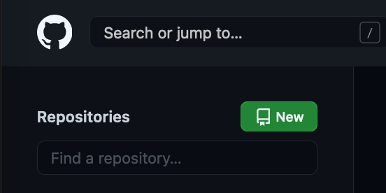
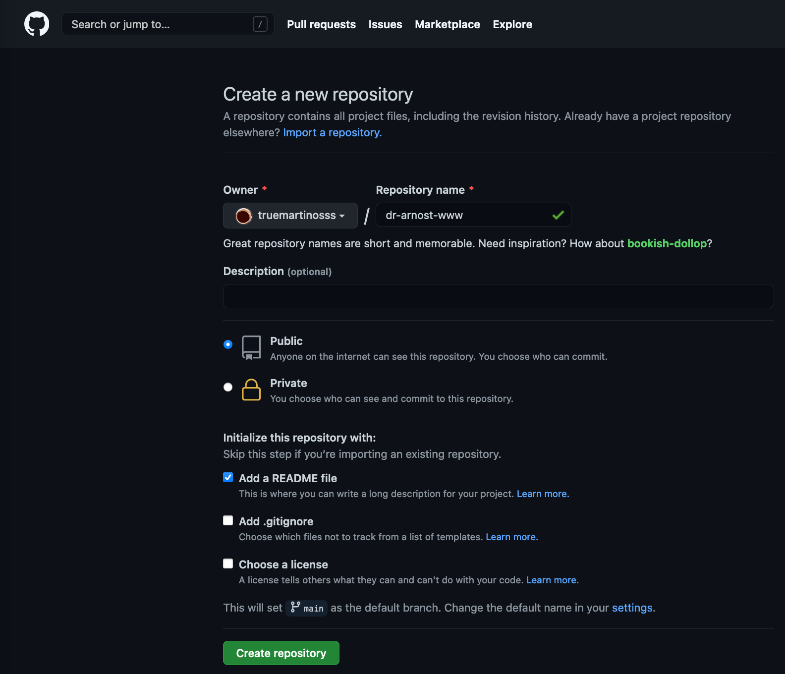

# GitHub Repository
- ### Místo kde bude uložena vaše HTML stránka.
- ### Múžete ji zde upravovat.
- ### Změny se automaticky nahrají na Netlify.com
- ### Změny je vždy nutné potvrdit tlačítkem `[Commit Changes]`.
# Vytvoření nové Repository
##

##

##

